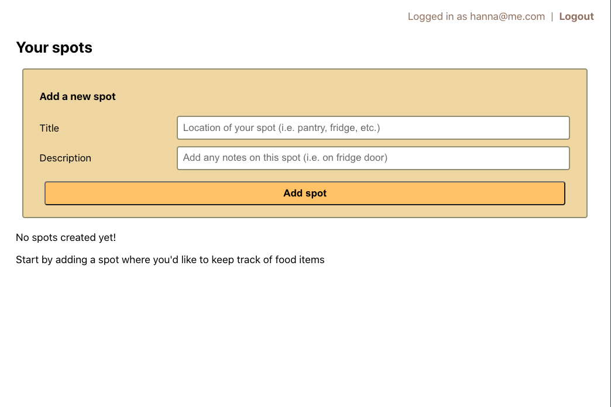
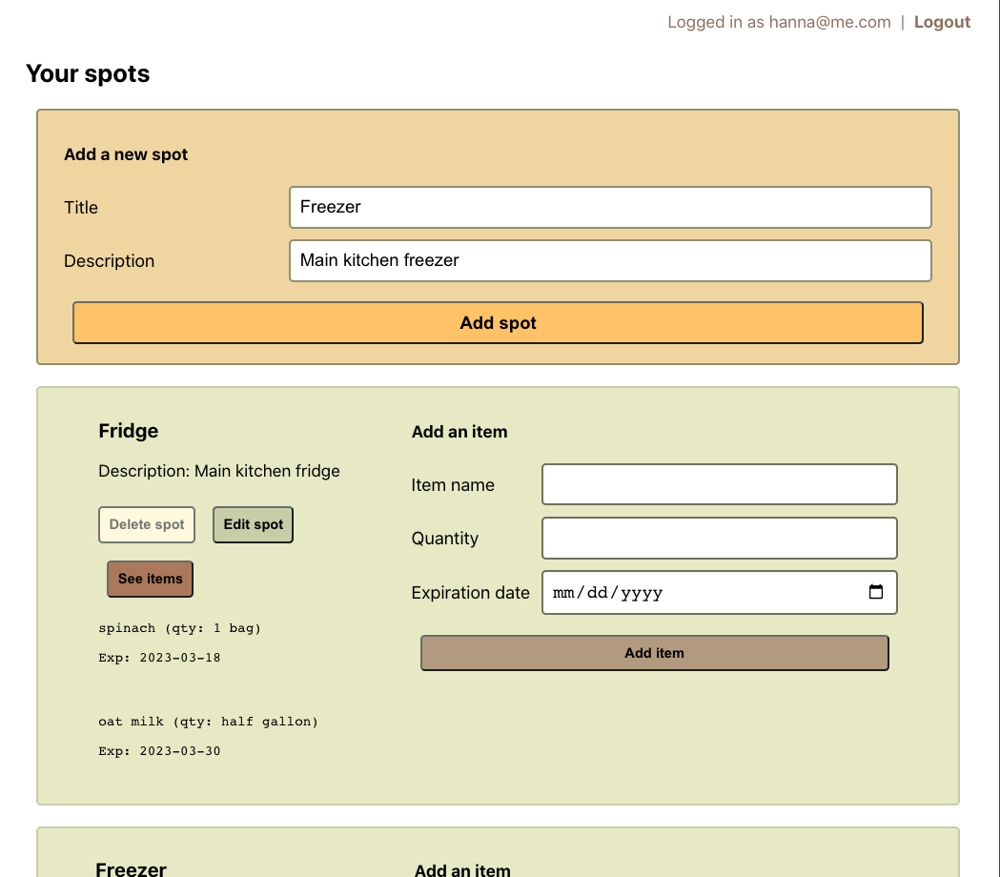

# Wastewise
According to the Environmental Protection Agency and the U.S. Department of Agriculture, food waste is estimated to be 30-40% of the entire US food supply, equating to about 219 pounds of waste per person.

To help minimize food waste, Wastewise helps you to keep track of your food items before they go bad.

No more bags of spoiled Trader Joe's spinach!

Resources:
- [Food waste guide by RTS](https://www.rts.com/resources/guides/food-waste-america/)
- [USDA on food waste](https://www.usda.gov/foodwaste/faqs)

### Walkthrough
<figure>
    <figcaption>Login</figcaption>
    
</figure>
<figure>
    <figcaption>Create spot</figcaption>
    
</figure>
<figure>
    <figcaption>Add items to your spot</figcaption>
    
</figure>

## Tech stack
|          | Technologies used            |
|----------|------------------------------|
| Backend  | Django, Python, PostgreSQL   |
| Frontend | React, JavaScript, HTML, CSS |
| Other    | Django Frameworks, Git       |

## Getting Started
- [Project planning](https://trello.com/invite/b/PEh64K59/ATTI39744314898e569baea8946417d090d1194B91FC/project-4)
- [Client side repository](https://github.com/hannaner/wastewise-client)
- Deployed website: :construction: under construction :construction:

## Next Steps
### Version 2
- AAU, I want to edit an item's details.
- AAU, I want to delete an item from a spot.
- AAU, I want to see an item turn red 2 days before it expires.
- AAU, I want to receive a notification in-app if it's nearing an item's expiration date.
- AAU, I want to sign up via Google OAuth.

### Version 3
- AAU, I want to add items by uploading a picture of a receipt.
- AAU, I'd like to reorder items by click and dragging.
- AAU, I want to share lists with others.
- AAU, I want to upload a picture for each item.
- AAU, I want to change themes.
- AAU, I want a text notification.
- AAU, I want to set my own alert time frame.